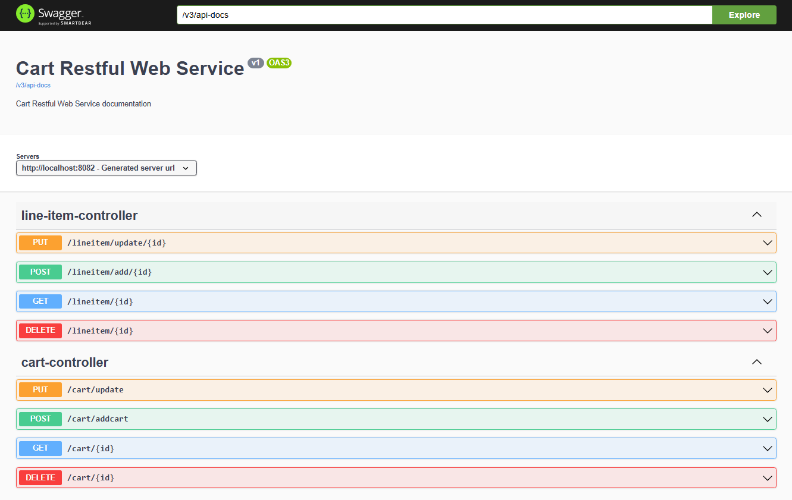

# Cart RESTful Service

## Project Overview

This project is a **Spring Boot RESTful service** designed to manage a shopping cart and its associated line items within a product catalog context. It provides a robust backend for e-commerce applications, allowing for seamless CRUD (Create, Read, Update, Delete) operations on cart and line item entities.

Developed with a strong emphasis on **Test-Driven Development (TDD)**, this service ensures high code quality through comprehensive **unit and integration testing**. It leverages **Spring Boot** for rapid development and focuses on providing a clean, performant REST API. Data persistence is handled by **Spring Data JPA** with an **H2 in-memory database** for development and testing, ensuring a lightweight setup. The service incorporates **custom exception handling** (`DataNotFound`, `InvalidInput`) to provide clear and consistent error responses. Furthermore, the project integrates **Swagger UI** for interactive API documentation and exploration, and **Spring Boot Actuator** for production-ready monitoring, offering a complete and well-rounded application solution.

## Features and Functionality

This service provides comprehensive API endpoints for managing shopping carts and their line items:

* **Cart Management (CRUD Operations):**

    * **Create Cart:** Allows the creation of new shopping carts.

    * **Retrieve Cart:** Fetch a specific cart by its unique ID.

    * **Update Cart:** Modify details of an existing cart, including its line items.

    * **Delete Cart:** Permanently remove a cart from the system.

* **Line Item Management (CRUD Operations):**

    * **Create Line Item:** Add a new product (line item) to an existing cart.

    * **Retrieve Line Item:** Fetch a specific line item by its unique ID.

    * **Update Line Item:** Modify details (e.g., quantity, price) of an existing line item within a cart.

    * **Delete Line Item:** Remove a specific line item from the system.

* **Robust Data Persistence:**

    * Utilizes **Spring Data JPA** for simplified and efficient data access layer creation.

    * Employs **H2 Database** in an in-memory mode, ideal for development, testing, and rapid prototyping, as it requires no external database setup. Data is ephemeral and reset on application restart.

* **RESTful API Design:**

    * Follows REST principles for clear, predictable, and stateless communication using standard HTTP methods (GET, POST, PUT, DELETE).

* **Centralized Exception Handling:**

    * Custom exception classes (`DataNotFound`, `InvalidInput`) are handled globally using `@ControllerAdvice` to provide consistent and informative error responses (e.g., HTTP 404 Not Found for missing data, HTTP 400 Bad Request for invalid inputs).

* **API Documentation (Swagger UI):**

    * Integrates `springdoc-openapi-ui` to automatically generate interactive API documentation, accessible via a web browser. This allows developers to explore endpoints, understand request/response formats, and test API calls directly from the browser.

* **Monitoring and Management (Spring Boot Actuator):**

    * Includes Spring Boot Actuator endpoints for monitoring and managing the application in production environments (e.g., health checks, metrics, environment details).

* **Code Quality & Testing:**

    * Configured with Maven Surefire Plugin for running both unit and integration tests.

    * Utilizes JaCoCo Maven Plugin for code coverage analysis.

## Technologies Used

* **Java:** JDK 11 (or higher)

* **Spring Boot:** 2.7.2 (Parent POM for streamlined Spring development)

    * `spring-boot-starter-web`: For building RESTful web applications.

    * `spring-boot-starter-data-jpa`: For ORM and database interaction.

    * `spring-boot-starter-validation`: For request body validation.

    * `spring-boot-starter-test`: For testing utilities (JUnit, Mockito).

    * `spring-boot-starter-actuator`: For monitoring and management endpoints.

* **H2 Database:** In-memory relational database.

* **Lombok:** To reduce boilerplate code (e.g., getters, setters, constructors).

* **Maven:** For project build automation and dependency management.

* **Swagger UI (springdoc-openapi-ui):** For API documentation.

* **JaCoCo Maven Plugin:** For code coverage reports.

* **Rest Assured:** For API testing.

## API Endpoints

The service runs on port `8082`. All endpoints are relative to `http://localhost:8082`.



### 1. Cart Controller (`/cart`)

Manages CRUD operations for `Cart` entities.

* **`GET /cart/{id}`**

    * **Description:** Retrieves a specific shopping cart by its ID.

    * **Method:** `GET`

    * **URL:** `http://localhost:8082/cart/{id}`

    * **Path Variable:** `id` (integer) - The ID of the cart to retrieve.

    * **Responses:**

        * `200 OK`: Returns the `Cart` object.

        * `400 Bad Request`: If `id` is less than 1 (InvalidInput).

        * `404 Not Found`: If no cart is found with the given `id` (DataNotFound).

    * **Example Response (Success):**

        ```json
        {
          "cartId": 1001,
          "lineitem": [
            {
              "itemId": 101,
              "productId": 1,
              "productName": "Biscuit",
              "quantity": 5,
              "price": 25.0
            }
          ]
        }
        ```
        

* **`POST /cart/addcart`**

    * **Description:** Adds a new shopping cart to the system. Includes initial line items.

    * **Method:** `POST`

    * **URL:** `http://localhost:8082/cart/addcart`

    * **Request Body:** A `Cart` object with its associated `LineItem` list.

        ```json
        {
          "cartId": 1004,
          "lineitem": [
            {
              "itemId": 104,
              "productId": 4,
              "productName": "Milk",
              "quantity": 1,
              "price": 50.0
            }
          ]
        }
        ```

    * **Responses:**

        * `200 OK`: Returns the added `Cart` object.

        * `400 Bad Request`: If any `LineItem` in the cart has invalid data (e.g., `itemId < 1`, `price < 1`, `productId < 1`, `productName` is null, `quantity < 1`).
          

    * **Example Response (Success):**

        ```json
        {
          "cartId": 1004,
          "lineitem": [
            {
              "itemId": 104,
              "productId": 4,
              "productName": "Milk",
              "quantity": 1,
              "price": 50.0
            }
          ]
        }
        ```

* **`PUT /cart/update`**

    * **Description:** Updates an existing shopping cart based on the provided `cartId`.

    * **Method:** `PUT`

    * **URL:** `http://localhost:8082/cart/update`

    * **Request Body:** A `Cart` object with the `cartId` of the cart to update and its new `LineItem` list.

        ```json
        {
          "cartId": 1001,
          "lineitem": [
            {
              "itemId": 101,
              "productId": 1,
              "productName": "Biscuit",
              "quantity": 10,
              "price": 25.0
            },
            {
              "itemId": 105,
              "productId": 5,
              "productName": "Bread",
              "quantity": 2,
              "price": 30.0
            }
          ]
        }
        ```

    * **Responses:**

        * `200 OK`: Returns the updated `Cart` object.

        * `400 Bad Request`: If any `LineItem` has invalid data (InvalidInput).

        * `404 Not Found`: If no cart is found with the provided `cartId` (DataNotFound).

    * **Example Response (Success):**

        ```json
        {
          "cartId": 1001,
          "lineitem": [
            {
              "itemId": 101,
              "productId": 1,
              "productName": "Biscuit",
              "quantity": 10,
              "price": 25.0
            },
            {
              "itemId": 105,
              "productId": 5,
              "productName": "Bread",
              "quantity": 2,
              "price": 30.0
            }
          ]
        }
        ```

* **`DELETE /cart/{id}`**

    * **Description:** Deletes a shopping cart by its ID.

    * **Method:** `DELETE`

    * **URL:** `http://localhost:8082/cart/{id}`

    * **Path Variable:** `id` (integer) - The ID of the cart to delete.

    * **Responses:**

        * `200 OK`: Returns the deleted `Cart` object (indicating success).

        * `400 Bad Request`: If `id` is less than 1 (InvalidInput).

        * `404 Not Found`: If no cart is found with the given `id` (DataNotFound).

    * **Example Response (Success):**

        ```json
        {
          "cartId": 1003,
          "lineitem": [
            {
              "itemId": 103,
              "productId": 3,
              "productName": "Juice",
              "quantity": 3,
              "price": 30.0
            }
          ]
        }
        ```

### 2. Line Item Controller (`/lineitem`)

Manages CRUD operations for `LineItem` entities, often in the context of a `Cart`.

* **`GET /lineitem/{id}`**

    * **Description:** Retrieves a specific line item by its ID.

    * **Method:** `GET`

    * **URL:** `http://localhost:8082/lineitem/{id}`

    * **Path Variable:** `id` (integer) - The ID of the line item to retrieve.

    * **Responses:**

        * `200 OK`: Returns the `LineItem` object.

        * `400 Bad Request`: If `id` is less than 1 (InvalidInput).

        * `404 Not Found`: If no line item is found with the given `id` (DataNotFound).

    * **Example Response (Success):**

        ```json
        {
          "itemId": 101,
          "productId": 1,
          "productName": "Biscuit",
          "quantity": 5,
          "price": 25.0
        }
        ```

* **`POST /lineitem/add/{cartId}`**

    * **Description:** Adds a new line item to an existing cart specified by `cartId`.

    * **Method:** `POST`

    * **URL:** `http://localhost:8082/lineitem/add/{cartId}`

    * **Path Variable:** `cartId` (integer) - The ID of the cart to which the line item will be added.

    * **Request Body:** A `LineItem` object.

        ```json
        {
          "itemId": 106,
          "productId": 6,
          "productName": "Cheese",
          "quantity": 1,
          "price": 120.0
        }
        ```

    * **Responses:**

        * `200 OK`: Returns the added `LineItem` object.

        * `400 Bad Request`: If `cartId` is less than 1, or if the `LineItem` data is invalid.

        * `404 Not Found`: If no cart is found with the given `cartId`.

    * **Example Response (Success):**

        ```json
        {
          "itemId": 106,
          "productId": 6,
          "productName": "Cheese",
          "quantity": 1,
          "price": 120.0
        }
        ```

* **`PUT /lineitem/update/{cartId}`**

    * **Description:** Updates an existing line item within a specific cart. The `itemId` in the request body identifies the line item to update, and `cartId` identifies the parent cart.

    * **Method:** `PUT`

    * **URL:** `http://localhost:8082/lineitem/update/{cartId}`

    * **Path Variable:** `cartId` (integer) - The ID of the cart that contains the line item to update.

    * **Request Body:** A `LineItem` object with the `itemId` of the item to update and its new details.

        ```json
        {
          "itemId": 101,
          "productId": 1,
          "productName": "Biscuit",
          "quantity": 7,
          "price": 25.0
        }
        ```

    * **Responses:**

        * `200 OK`: Returns the updated `LineItem` object.

        * `400 Bad Request`: If `cartId` is less than 1, or if the `LineItem` data is invalid (e.g., `itemId` not found, price/quantity invalid).

        * `404 Not Found`: If no cart is found with the provided `cartId` or the line item itself is not found in the repository.

    * **Example Response (Success):**

        ```json
        {
          "itemId": 101,
          "productId": 1,
          "productName": "Biscuit",
          "quantity": 7,
          "price": 25.0
        }
        ```

* **`DELETE /lineitem/{id}`**

    * **Description:** Deletes a specific line item by its ID.

    * **Method:** `DELETE`

    * **URL:** `http://localhost:8082/lineitem/{id}`

    * **Path Variable:** `id` (integer) - The ID of the line item to delete.

    * **Responses:**

        * `200 OK`: Successful deletion (response body is empty for void method).

        * `400 Bad Request`: If `id` is less than 1 (InvalidInput).

        * `404 Not Found`: If no line item is found with the given `id` (DataNotFound).

## Integration Testing 

Integration testing in this project focuses on verifying the interactions and functionality of different layers and components of the RESTful service working together as a cohesive unit. It ensures that the controllers, services, repositories, and the underlying database (H2 in-memory) communicate correctly and that the API endpoints behave as expected when handling requests.

 

## Database Schema

The service uses an H2 in-memory database. The schema is automatically created/dropped on application startup/shutdown based on JPA entities (`ddl-auto=create-drop`).

### `cart` Table

Stores information about individual shopping carts.

* `cart_id` (Primary Key, auto-generated)
  

### `line_item` Table

Stores details of items within a cart.

* `item_id` (Primary Key, auto-generated)

* `product_id` (Integer)

* `product_name` (String)

* `quantity` (Integer)

* `price` (Double)

* `fk` (Foreign Key referencing `cart_id` in the `cart` table)
  

### Initial Data

The application is configured to pre-populate the database with some sample data on startup from an `import.sql` or `data.sql` script (implicitly handled by `spring.datasource.initialization-mode=always`).

```sql
INSERT INTO cart(cart_id) values
(1001),
(1002),
(1003);

INSERT INTO line_item(item_id,product_id,product_name,quantity,price,fk) values
(101,001,'Biscuit',5,25.00,1001),
(102,002,'Shampoo',2,10.00,1002),
(103,003,'Juice',3,30.00,1003);

```

## Exception Handling

The service implements global exception handling using `@ControllerAdvice` to provide consistent error responses:

* **`DataNotFound` Exception:**
    * **Triggered by:** When a requested entity (Cart or LineItem) cannot be found by its ID.
    * **HTTP Status:** `404 Not Found`
    * **Response Body Example:**

        ```json
        {
          "message": "No Cart with id: 9999",
          "timestamp": "2025-06-11"
        }
        ```
   

* **`InvalidInput` Exception:**
    * **Triggered by:** When input data for an operation (e.g., ID less than 1, missing required fields, invalid quantity/price in LineItem).
    * **HTTP Status:** `400 Bad Request`
    * **Response Body Example:**

        ```json
        {
          "message": "Invalid Input",
          "timestamp": "2025-06-11"
        }
        ```

## How to Run the Project

Follow these steps to get the Spring Boot RESTful service running on your local machine.

### Prerequisites

* **Java Development Kit (JDK):** Version 11 or higher installed and configured.
* **Apache Maven:** Installed and configured in your system's PATH.
* **IDE:** An IDE like IntelliJ IDEA (recommended for Spring Boot) or Eclipse with Spring Tools Suite

### Step 2: Open in Your IDE
Navigate to the project directory and open it in your preferred IDE. The IDE should recognize it as a Maven project.

* **IntelliJ IDEA (Recommended):**
    1.  Open IntelliJ IDEA.
    2.  From the welcome screen or the top menu bar, click `File` > `Open....`
    3.  Navigate to the root directory of the cloned project (the folder containing `pom.xml`).
    4.  Select the `pom.xml` file or the project's root folder and click `Open`.
    5.  IntelliJ IDEA will typically detect it as a Maven project and ask if you want to import it. Confirm to import the project as a Maven project. The IDE will then download all necessary Maven dependencies and index the project.

* **Eclipse:**
    1.  Open Eclipse.
    2.  Go to the top menu bar, click `File` > `Import....`
    3.  In the "Import" wizard, expand `Maven` and select `Existing Maven Projects`. Click `Next`.
    4.  Click the `Browse...` button next to "Root Directory" and navigate to the root directory of the cloned project (where `pom.xml` is located).
    5.  Once selected, the projects found in that directory will be listed. Ensure it's checked.
    6.  Click `Finish`. Eclipse will import the Maven project, download dependencies, and build the workspace.

### Step 3: Build the Project
Ensure your IDE has Maven properly configured. You can build the project from your IDE or via the command line:

```bash
mvn clean install
```
This command compiles the code, runs tests, and packages the application into a JAR file in the `target/` directory.

### Step 4: Run the Application

You can run the Spring Boot application directly from your IDE or via the command line:

* **From IDE (Recommended):**
    * Locate the main application class (e.g., `com.store.productcatalogue.Cart.CartApplication.java` - the one with the `@SpringBootApplication` annotation and `main` method).
    * Right-click on the main class and select `Run 'CartApplication.main()'` (or similar).

* **From Command Line:**
    * Navigate to the project's root directory in your terminal.
    * Run the generated JAR file:

        ```bash
        java -jar target/Cart-0.0.1-SNAPSHOT.jar # Adjust JAR name if different
        ```
The application will start, typically on `http://localhost:8082` (as configured in `application.properties`). You will see Spring Boot startup logs in your console.

### Step 5: Access the API Endpoints and H2 Console

Once the application is running, you can interact with the API:

* **API Endpoints:**
    Use a tool like [Postman](https://www.postman.com/downloads/), Insomnia, or `curl` to send HTTP requests to the endpoints listed in the "API Endpoints" section (e.g., `http://localhost:8082/cart/1001`).

* **Swagger UI (API Documentation):**
    Open your web browser and go to:
    `http://localhost:8082/swagger-ui.html`
    This provides an interactive interface to view and test all available API endpoints.

* **H2 Console (Database Inspection):**
    Open your web browser and go to:
    `http://localhost:8082/h2-console`
    On the H2 Console login page, use these details:
    * **JDBC URL:** `jdbc:h2:mem:dbs-casestudy;DB_CLOSE_ON_EXIT=FALSE;DB_CLOSE_DELAY=-1;`
    * **User Name:** `sa`
    * **Password:** (Leave blank)
    Click `Connect`. You can now inspect the `CART` and `LINE_ITEM` tables, view the initial data, and run SQL queries.
